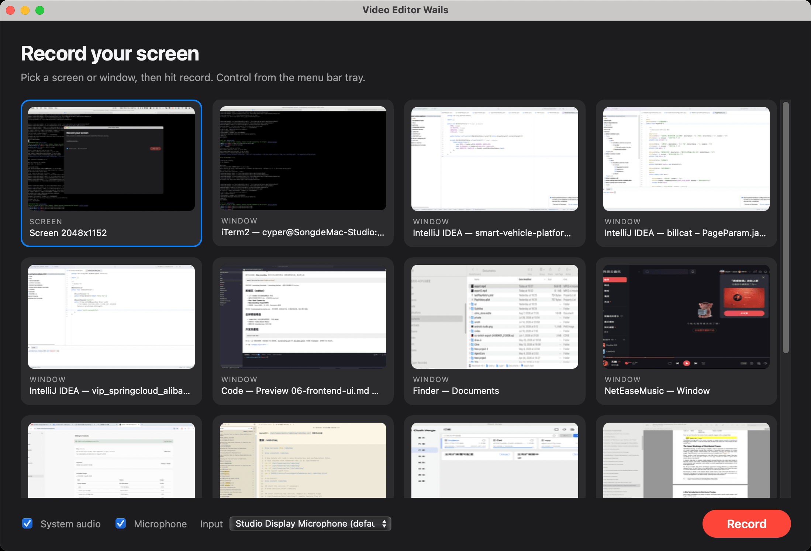

# EggplantRecorder

macOS 15+ screen recorder and light video editor, built with **Wails v3** (React + TypeScript frontend, Go + ScreenCaptureKit backend).

Repo: [github.com/uniquejava/eggplant-recorder](https://github.com/uniquejava/eggplant-recorder) · Bundle ID: `click.yinsb.eggplantrecorder`



## Tutorial

从零搭建说明（多篇串联）：**[docs/README.md](./docs/README.md)**

## Requirements

- macOS 15 Sequoia or later
- Go 1.25+
- Node.js / npm
- [Wails v3 CLI](https://v3.wails.io): `go install github.com/wailsapp/wails/v3/cmd/wails3@v3.0.0-beta.6`
- Xcode Command Line Tools
- `ffmpeg` / `ffprobe` on `PATH` (for trim/export): `brew install ffmpeg`

## Run

```bash
wails3 task dev
# or
wails3 build && open bin/EggplantRecorder.app
```

On first launch, grant **Screen Recording** (and **Microphone** / system audio if enabled) in System Settings → Privacy & Security.

## Features

- Pick a display or window to record
- System audio + microphone toggles (ScreenCaptureKit, macOS 15+)
- Excludes this app’s windows from the capture when recording a display
- Preview, split / delete clips, export MP4

## Project layout

- `main.go` / `recorderservice.go` — Wails v3 app + service bindings
- `internal/capture/` — Objective-C ScreenCaptureKit bridge via CGo
- `frontend/` — React UI (source picker → recording → editor)
- `docs/` — step-by-step build tutorial
